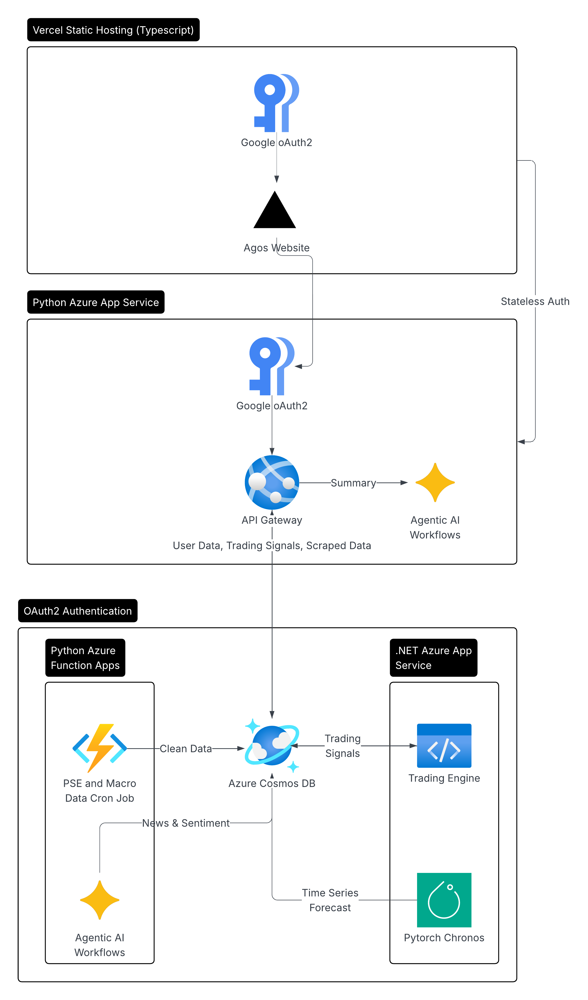

# AGOS

AGOS is a multi-package platform for Philippine market data ingestion, portfolio operations, forecasting, and operator-facing research and trading workflows.

## Repository layout

| Path | Role |
| --- | --- |
| `frontend/` | Vite + React UI for landing, login, research, portfolio, trading, and agent workflows. |
| `backend/` | FastAPI service for portfolio CRUD, live PSE market access, stored Cosmos data reads, and AGOS agent threads and runs. |
| `engine/` | FastAPI service for forecasting and rule-gated trade evaluation. |
| `cron/` | Async ingestion pipeline that writes PSE, PSA, BSP, and news-sentiment data into Cosmos DB. |
| `research/` | Offline Chronos training and evaluation workspace. |

## Local development model

- There is no global Python environment for this repo.
- `backend/`, `engine/`, `cron/`, and `research/` are separate Python workspaces. Install dependencies and run commands from inside the target directory.
- `backend` must run on port `8000`.
- `engine` must run on port `5000`.
- The frontend defaults to `http://localhost:8000` for backend calls and `http://localhost:5000` for engine calls.
- The engine expects `BACKEND_API_URL=http://localhost:8000/api/v1`.

## Service startup

Start the backend, engine, and frontend for the full local stack. Run `cron` when you need fresh Cosmos data.

### Backend

```bash
cd backend
pip install -r requirements.txt
uvicorn app.main:app --host 0.0.0.0 --port 8000
```

### Engine

```bash
cd engine
pip install -r requirements.txt
uvicorn app.main:app --host 0.0.0.0 --port 5000
```

### Frontend

```bash
cd frontend
npm install
npm run dev
```

### Cron

```bash
cd cron
pip install -r requirements.txt
python main.py
```

### Research

Use this only for dataset preparation, training, and evaluation. The runtime model is served from `engine/`, not from `research/`.

## Shared dependencies

- Cosmos DB is the shared storage layer.
- Firebase ID tokens are used by `frontend`, `backend`, and `engine`.
- Gemini is required for backend agent runs and cron news structuring.
- Tavily is required for cron news search.

## Dev bypass

Frontend bypass is guarded by `VITE_ENABLE_DEV_BYPASS=true`.

Backend and engine bypass are guarded by:

- `DEV_BYPASS_ENABLED=true`
- `DEV_ADMIN_TOKEN=dev_admin_token`

The frontend uses `dev_admin_token` when bypass is enabled, so the backend and engine token must match it.

## Verification

- Frontend: `cd frontend && npm run lint && npm run build`
- Backend: `cd backend && pytest tests`
- Engine: `cd engine && pytest tests`
- Cron: `cd cron && ruff check . && pytest tests`
- Cron data check: `cd cron && python verify_results.py`

## Current runtime shape

- `cron` writes `pse_stock_data`, `macro_data`, and `news_sentiment_data`.
- `backend` reads those containers, manages portfolio state, and persists agent threads, messages, runs, and events.
- `engine` reads historical prices from Cosmos when possible, falls back to backend chart data when Cosmos history is too sparse, and fetches portfolio state from `backend`.
- `frontend` exposes `/research`, `/portfolio`, `/trading`, and `/agent` behind auth, with `/` and `/login` as public routes.

## Current caveats

- `cron/pyproject.toml` and `cron/.env.example` lag the current cron runtime. Use `cron/config.py` and `cron/requirements.txt` as the safer reference.
- `research/requirements.txt` is not a complete description of the research environment. See `research/README.md` for the actual script dependencies.
- Backend tests currently focus on the agent subsystem more than the portfolio and market paths.

## Package docs

- `backend/README.md`
- `engine/README.md`
- `cron/README.md`
- `research/README.md`
